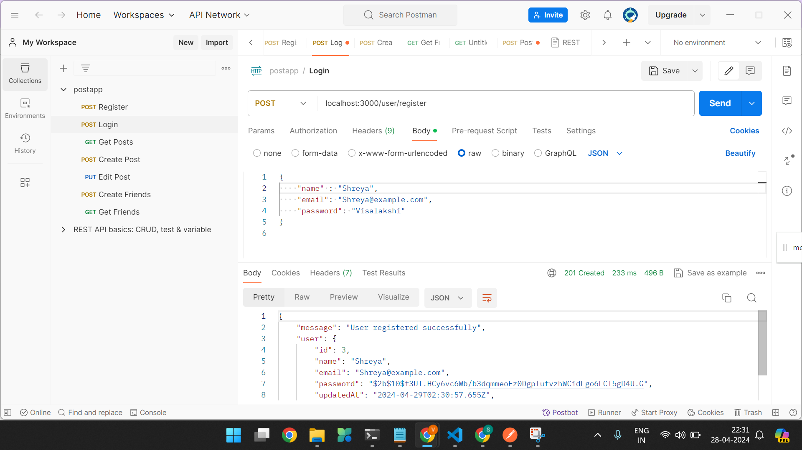
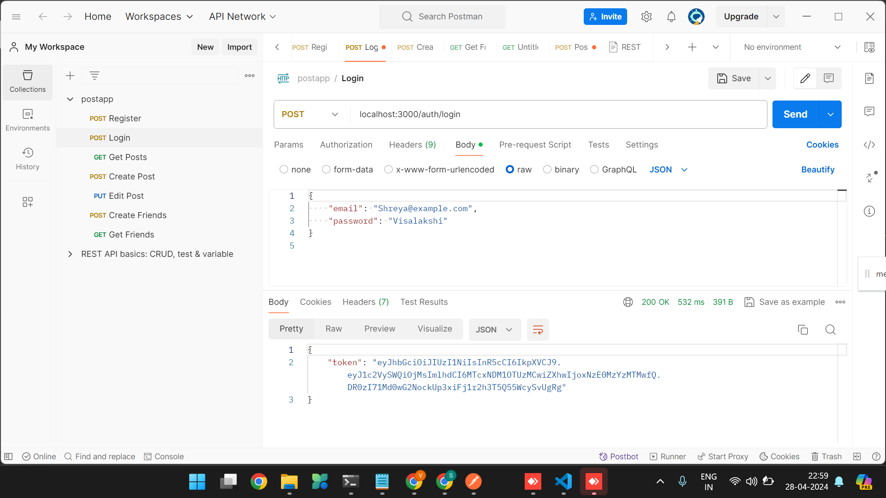

## Technologies Required

- **Node.js and Express.js**: For building the backend server and handling HTTP requests.
- **JWT**: For user authentication and token generation.
- **Sequelize**: As an ORM (Object-Relational Mapping) for interacting with the PostgreSQL database.
- **GCP Storage**: For storing media files like photos.
- **PostgreSQL**: As the relational database for storing user data, posts, etc.

### Req 1

#### Express.js App with PostgreSQL
- Initialize a Node.js project, install Express.js and Sequelize.
- Set up a PostgreSQL database and configure Sequelize to interact with it.

#### User Registration
- Create routes for user registration.
- Use Sequelize to define a User model with fields: name, email, and password.
- Implement validation for required fields and password hashing for security.

#### User Login and JWT Token
- Implement routes for user login.
- Upon successful authentication, issue a JWT token to the user.

#### Creating Posts with Photos
- Implement routes for creating posts.
- Each post should have a description and a photo.
- Use GCP Storage to store the photos.
- Configure Sequelize to handle post data and its relationship with users.

## API Req Images

